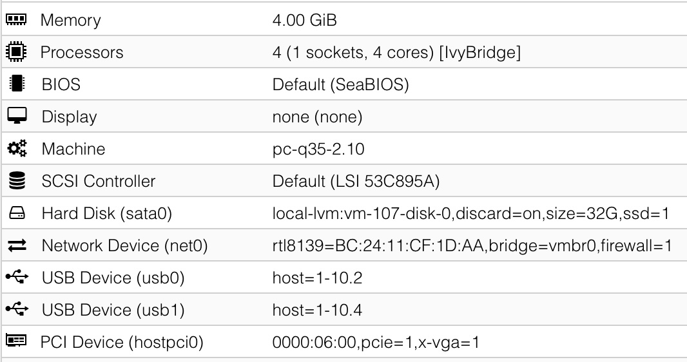

[Back to Proxmox](README.md)

## Windows XP
### Machine type
Either i440 latest, or q35-2.10. Any newer version of q35 will crash the XP installer with an error about the bios not being fully APCI compliant.

If we go to the Options tab and turn off APCI, then newer versions of q35 will not crash the XP installer, but we'll have other problems with hardware drivers that make it not worth it. So we should stick to q35-2.10. Note that this will make XP 32 & 64 bit unable to shut down fully, and XP 32 bit shut down when trying to reboot.

Also note that it might be possible to forcefully insert a newer community compiled apci.sys driver for XP, but I haven't tested this. Losing the ability to shut down fully from inside the VM isn't big deal, we can always force stop the VM from the Proxmox dashboard.

If we select i440 latest, we won't have any issues with APCI. The only potential issue is that the i440 machine type only has PCI passthrough. We can still passthrough PCIe devices, but they will appear as PCI to the VM. Note that I have tried this with my PCIe GPU (the GT 640), and I didn't see any performance hit, so this might be a non-issue.

The other upside of using i440 is the ability to emulate an Intel AC97 sound card, which Windows XP supports out of the box.

### Virtual hard drive
Since the Windows XP & Vista installer will not know how to properly format modern hard drives, we first should create & format our VM drive on a Windows 10/11 VM with MBR, NTFS. Then reassign the drive to the Win XP/Vista VM and proceed with installation. 

For the installation, virtual hard disk must be either IDE or SATA (SATA is faster than IDE). We can enable Discard and SSD emulation and possibly use SSD Tweaker Pro to run Trim. 

For XP 64 bit, we have the option to use VirtIO for our storage device, but it will have to be after the initial Windows installation with IDE/SATA. To prepare for VirtIO drivers installation, add a dummy 1GB virtual hard disk and select the VirtIO protocol. After the installation, Windows will ask for drivers for an unknown SCSI controller, and we can find the drivers in the VirtIO ISO. 

After successfully installing the VirtIO SCSI controller, we can stop the VM, detach our boot disk, reattach it using the VirtIO protocol, make sure Discard is checked for TRIM support, and the device is selected in Boot Order in the Options tab. Now we can remove the dummy 1GB VirtIO disk.

On XP 32 bit, the VirtIO drivers for storage doesn't work for me, so I have to stick to SATA.

### Network card
VirtIO. After installation, Windows will ask for drivers for unknown Ethernet card, and we can find drivers in the VirtIO ISO. This is the recommended option as it is the most performant.

Alternatively, select Realtek 8139 since it will work under XP and Vista by default, no need for 3rd party drivers. Pick this if you don't care about performance.

### Other notes


If installing XP 32 bit, we need to press F6 when the installer begins and install a AHCI driver. We'll need to attach [xp-satadrivers-ich9-flp.img](disk-images/xp-satadrivers-ich9-flp.img) as a floppy for the installer to see it. To do this, upload the img to proxmox, and add this line to the vm's conf
```
args: -fda /var/lib/vz/template/iso/xp-satadrivers-ich9-flp.img
```
After pressing F6, pick the one that says **Intel(R) ICH9R/DO/DH SATA AHCI Controller**

Great resources:
- https://forum.mattkc.com/viewtopic.php?t=206

## Windows Vista
### Machine type
Can run perfectly with i440 or q35 latest, no additional AHCI drivers required.

### Virtual hard drive
Since the Windows XP & Vista installer will not know how to properly format modern hard drives, we first should create & format our VM drive on a Windows 10/11 VM with MBR, NTFS. Then reassign the drive to the Win XP/Vista VM and proceed with installation. 

For the installation, virtual hard disk must be either IDE or SATA (SATA is faster than IDE). To prepare for VirtIO drivers installation, add a dummy 1GB virtual hard disk and select the VirtIO protocol. After the installation, Windows will ask for drivers for an unknown SCSI controller, and we can find the drivers in the VirtIO ISO. 

After successfully installing the VirtIO SCSI controller, we can stop the VM, detach our boot disk, reattach it using the VirtIO protocol, make sure Discard is checked for TRIM support, and the device is selected in Boot Order in the Options tab. Now we can remove the dummy 1GB VirtIO disk.

### Network card
VirtIO. After installation, Windows will ask for drivers for unknown Ethernet card, and we can find drivers in the VirtIO ISO. This is the recommended option as it is the most performant.

Alternatively, select Realtek 8139 since it will work under XP and Vista by default, no need for 3rd party drivers. Pick this if you don't care about performance.

### Other notes


If we run the VM with an emulated GPU such as by using the VMWare compatible display, Windows Vista might not load the drivers for our passed through GPU correctly, giving a code 12 error. In this case, we should try setting Display to None and ticking the Primary GPU checkbox for the GPU passthrough.

## Windows 98
### Machine type
Can run with the latest i440 machine type (9.0 at this time), but according to [this Vogons post](https://www.vogons.org/viewtopic.php?t=94012), we can get SB16 emulation if we pick 2.11. However picking 2.11 will make the machine unable to shut down fully. 

### Virtual hard drive
Has to be IDE. There are no Win 9x VirtIO drivers. The SSD emulation and Discard checkboxes don't matter because there is no way to do TRIM on Win 9x.

Since the Windows 98 installer will not know how to properly format modern hard drives, we first should format our VM drive on a Windows 10/11 VM with MBR, FAT32. Then reassign the drive to the Win 98 VM and proceed with installation.

### Network card
For networking, select Intel E1000. Drivers can be installed from the PRO98_10.1.exe file in [Win98drivers.iso](disk-images/Win98drivers.iso). Go to device manager, install drivers, and browse to the PRO1000 folder.

This iso also contains 7z and NVidia drivers.

### Other notes
According to the Vogons page, we need `args: -machine hpet=off` to ensure consistent performance for 16 and 32 bit OSes. HPET stands for High Precision Event Timer. Maybe this has something to do with the bugs that patcher9x is trying to fix?

I have not been able to directly pass through USB mouse and keyboard, Windows will just crash with Windows Protection Error as soon as I move the mouse. Passing through mouse & keyboard using the emulated PS/2 method works, but the mouse has a weird issue. Whenever I drag click or scroll, the cursor jumps to the top left of the screen. Very annoying. Turns out this is caused by the [virtual QEMU Tablet USB device](https://pve.proxmox.com/wiki/Manual:_qm.conf) injected into all VMs by default. Disabling this will fix the mouse. On the Proxmox dashboard, simply go to the Options tab of the VM, double click on Use tablet for pointer and select No. Alternatively, add this line to the vm conf file using `nano /etc/pve/qemu-server/[vmid].conf`
```
tablet: 0
```

After installation, copy the Win98 folder of the Windows 98 CD to C: drive. We need to do this because the CD drive will disappear some time during the next step. Then go to Device Manager, select Plug and Play BIOS, update drivers, show all hardware, select PCI Bus. We'll need the Windows 98 CD for this part. After that, a few more devices will be recognised and installed. 

For the GPU pass through to work properly, after installing the GPU drivers, we need to remove the emulated GPU in Device Manager so there won't be Input/Output range conflicts.

Great resources:
- https://www.vogons.org/viewtopic.php?t=94012
- https://blog.stevesec.com/2024/05/03/installing-windows-98-on-a-proxmox-ve/
- https://github.com/JHRobotics/patcher9x
- https://www.baeldung.com/linux/mouse-events-input-event-interface
