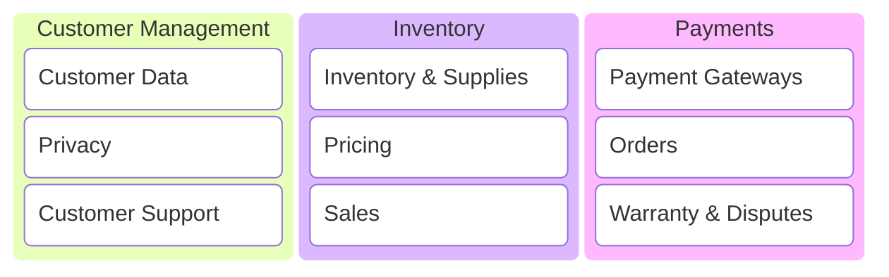

[Back](./README.md)

# Preface

I am still learning and gathering experience with DDD. Most of what I learned is from the original Domain-Driven Design book by Eric Evans (a.k.a. "the blue book"), and from real life experience. This document represents my current state of knowledge, which could be wrong. However, I am trying to capture the essence rather than every detail, so hopefully that will keep the mistakes to a minimum.

I believe that DDD applies more to medium to large size projects in a team, and less to small size hobby projects that we do on our own, because of how it heavily emphasize communication. Having said that, successful hobby projects can attract people and grow into bigger projects, so the philosophy here will still be useful.

# Domain Driven Design

**Domain Driven Design** (DDD) is a framework of mind for creating software that stays as close to what it is meant to do as possible. In the corporate world, this means staying close to the business requirements. In the startup world or small-scale hobby projects, this means sticking to the vision that you have for it.

## What is a Domain

This "_what it is meant to do_", "_business requirements_", "_vision_", or as known in more general terms as the **problem space**, is called the **Domain** in DDD. It encapsulates the essence of the problem that we try to solve with the software.

There's a hierarchical structure to this. We have top-level domains, from which you can extract smaller subdomains. 

From my experience in the corporate world, the top-level domains are the top-level business areas surrounding the software. As a purely theoretical example, if we are making a shopping app, then the Domains might be Customer Management, Inventory, Payments. Within Customer Management, we might have Customer Data, Privacy, Customer Support as subdomains, and so on.

```mermaid
---
config:
  kanban:
    ticketBaseUrl: 'https://mermaidchart.atlassian.net/browse/#TICKET#'
---
kanban
  [Customer Management]
    [Customer Data]
    [Privacy]
    [Customer Support]
  [Inventory]
    [Inventory & Supplies]
    [Pricing]
    [Sales]
  [Payments]
    [Payment Gateways]
    [Orders]
    [Warranty & Disputes]
```

How these Domains and Subdomains are defined will be based on our understanding of how the business functions, or ought to function. So the task of defining the Domains mostly should fall onto very senior roles in the business, such as a director, at least from my experience.

From the technical standpoint, we only need to know that Domains and Subdomains represent the problems of the business. Understanding what counts as a Domain and a Subdomain is not very important right now, as that will only come as part of working for the same business for some time. However, the framework of mind that helps understanding the Domain is a transferable skill, and worth investigating.

Since Subdomains are just smaller Domains within bigger Domains, I will refer to all of them as Domains from now for simplicity.

## Understanding the Domain

In order to create software that serves a Domain, we first need to understand what it is. Actually, DDD is mostly about achieving a deep understanding of Domains, so if we can do this, we are 80% of the way there.

### Ubiquitous Language

**Communication is key**. This involves ALL forms of communications, for example:
- Speech such as ad-hoc conversations and meetings.
- Texts such as messages and emails.
- Documents such as source code, wiki pages and tutorials, design documents and test reports.

It is basically everything. If there is an idea to convey between human beings, it falls under DDD's watch (if it is related to the work, that is). DDD rightly points out that the understanding of a Domain relies heavily on how well ideas are communicated.

How do we ensure that communication is done well? According to DDD, the same as with any other areas of life, by getting everyone to use a **common, consistent, ubiquitous language**.

In life, it is difficult for 2 people to communicate well if they speak different languages, or sometimes even different dialects of the same language. Although that's not the same as the **Ubiquitous Language** that DDD speaks of, the idea is the same. I have seen inconsistent use of language within the same software project way too often. The same concept is called many different terms. 

It may seem harmless at first, but consider this scenario where you need to read source code to understand what it is trying to achieve. In one package, you see the User class, so you look for its use in the rest of the code, but you couldn't find much. Turns out, it is called Customer in another package, and Client in another. You discovered this only after finding the adapters that convert objects of these types. 

Not only this is a lot of wasteful object creations, it creates huge frictions when the code is used as a communication tool.

The way I've dealt with this is to create a **Glossary document** for the Domain, point all related design documents to it, and ask everyone to use it consistently.

_So create and enforce a Ubiquitous Language, get everyone to use it in the context of the Domain._

### Domain Experts

Alongside the Ubiquitous language, we need to identify the **Domain Experts**. These are people who serve as the sources of truth for everything related to the Domain, because they truly know it best.

To identify them, simply look for where the feature requests of our software came from. This might be the Product Owners if we have them in the team, or just a developer from another team who's making requests to our team. It's anyone who owns the idea, the concept of what they want our team to build.

Once we've identified them, we should talk to them as much as we can, because they are the key to understanding the Domain. Talk to them when they make a request, when we've made some progress, when we have a demo, when there are some hiccups, or when we simply want to deepen our understanding.

The blue book really emphasizes on the importance of this. How breakthroughs in understanding of the Domain through communication with the Domain Experts and through deep thinking, lead to fundamental and positive changes in the software.

### It is an iterative process

Understanding the Domain is not a one-time deal, it is an iterative process. 

What we understand about the Domain in the beginning will never be perfect. Not only that, but the Domain itself evolves, it changes and moves forward. Or at least the Domain Experts' knowledge of it.

Like agile development, we start with something rough, then iteratively refine our understanding, sometimes achieving breakthroughs. This process gradually moves the software towards better serving the Domain.

### Again, communication is key

Perhaps you have heard about techniques or ceremonies to extract Domain knowledge, such as Event Storming. 

I would like to stress again, that communication is key. Techniques such as Event Storming may work for some, but not others, so do not put too much weight to them and be flexible. 

As long as we gain knowledge, it does not matter much whether we do it using Event Storming or any other technique.

## The Domain Model