[Back](./README.md)

# Preface

I am still learning and gathering experience with DDD. Most of what I learned is from the original Domain-Driven Design book by Eric Evans (a.k.a. "the blue book"), and from real life experience. This document represents my current state of knowledge, which could be wrong. However, I am trying to capture the essence rather than every detail, so hopefully that will keep the mistakes to a minimum.

As such, the knowledge on this page is extremely condensed, it is not meant to replace the blue book. It is for organising our thoughts after we've already read the book.

I believe that DDD applies more to medium to large size projects in a team, and less to small size hobby projects that we do on our own, because of how it heavily emphasize communication. Having said that, successful hobby projects can attract people and grow into bigger projects, so the philosophy here will still be useful.

# Domain Driven Design

**Domain Driven Design** (DDD) is a framework of mind for creating software that stays as close to what it is meant to do as possible. In the corporate world, this means staying close to the business requirements. In the startup world or small-scale hobby projects, this means sticking to the vision that you have for it.

## What is a Domain

This "_what it is meant to do_", "_business requirements_", "_vision_", or as known in more general terms as the **problem space**, is called the **Domain** in DDD. It encapsulates the essence of the problem that we try to solve with the software.

There's a hierarchical structure to this. We have top-level domains, from which you can extract smaller subdomains. 

From my experience in the corporate world, the top-level domains are the top-level business areas surrounding the software. As a purely theoretical example, if we are making a shopping app, then the Domains might be Customer, Inventory, Payments. Within User, we might have Customer Data, Privacy, Customer Support as subdomains, and so on.

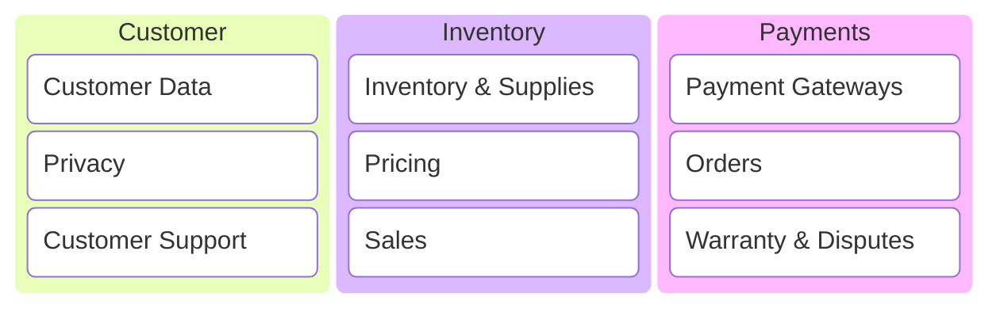

How these Domains and Subdomains are defined will be based on our understanding of how the business functions, or ought to function. So the task of defining the Domains mostly should fall onto very senior roles in the business, such as a director, at least from my experience.

From the technical standpoint, we only need to know that Domains and Subdomains represent the problems of the business. Understanding what counts as a Domain and a Subdomain is not very important right now, as that will only come as part of working for the same business for some time. However, the framework of mind that helps understanding the Domain is a transferable skill, and worth investigating.

Since Subdomains are just smaller Domains within bigger Domains, I will refer to all of them as Domains from now for simplicity.

## Understanding the Domain

In order to create software that serves a Domain, we first need to understand what it is. Actually, DDD is mostly about achieving a deep understanding of Domains, so if we can do this, we are 80% of the way there.

### Ubiquitous Language

**Communication is key**. This involves ALL forms of communications, for example:
- Speech such as ad-hoc conversations and meetings.
- Texts such as messages and emails.
- Documents such as source code, wiki pages and tutorials, design documents and test reports.

It is basically everything. If there is an idea to convey between human beings, it falls under DDD's watch (if it is related to the work, that is). DDD rightly points out that the understanding of a Domain relies heavily on how well ideas are communicated.

How do we ensure that communication is done well? According to DDD, the same as with any other areas of life, by getting everyone to use a **common, consistent, ubiquitous language**.

In life, it is difficult for 2 people to communicate well if they speak different languages, or sometimes even different dialects of the same language. Although that's not the same as the **Ubiquitous Language** that DDD speaks of, the idea is the same. I have seen inconsistent use of language within the same software project way too often. The same concept is called many different terms. 

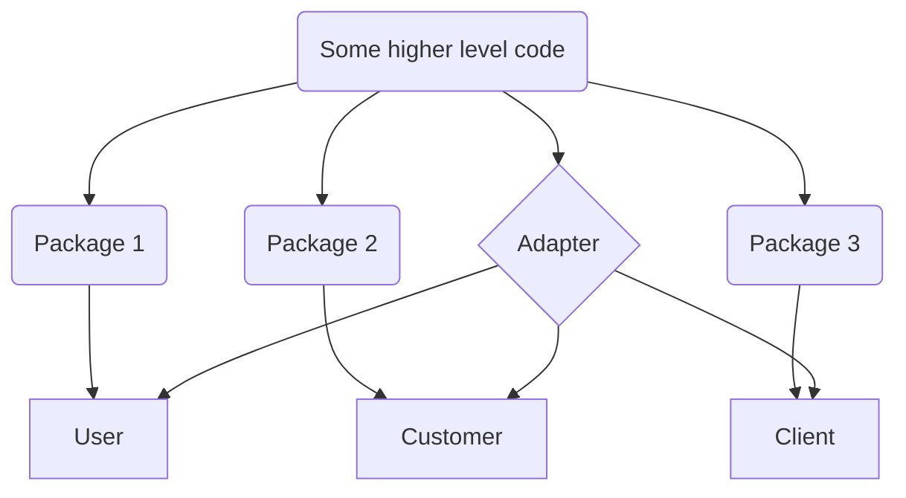

It may seem harmless at first, but consider this scenario where you need to read source code to understand what it is trying to achieve. In one package, you see the User class, so you look for its use in the rest of the code, but you couldn't find much. Turns out, it is called Customer in another package, and Client in another. You discovered this only after finding the adapters that convert objects of these types. 

And this is all internal code within the same department!

Not only this is a lot of wasteful object creations, it creates huge frictions when the code is used as a communication tool. It is a lot more efficient if the same concept is represented by a single class instead of 3 different classes.

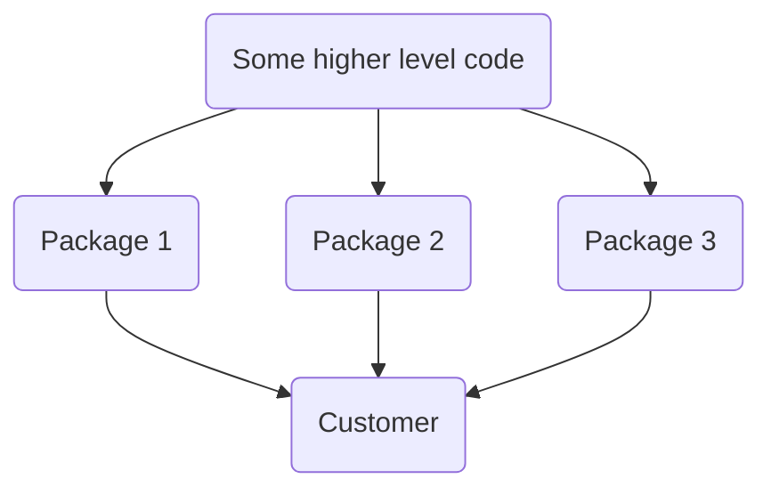

The way I've dealt with this is to create a **Glossary document** for the Domain, point all related design documents to it, and ask everyone to use it consistently.

| Term | Definition |
|---|---|
| App | The software that our team ABC is building for the purpose of XYZ |
| Customer | The end user, customer, client of the App |

_So create and enforce a Ubiquitous Language, get everyone to use it in the context of the Domain._

The _context_ that I'm speaking of here is another important concept which we will tackle later.

### Domain Experts

Alongside the Ubiquitous language, we need to identify the **Domain Experts**. These are people who serve as the sources of truth for everything related to the Domain, because they truly know it best.

To identify them, look for where the feature requests of our software came from. This might be the Product Owners if we have them in the team, or just a developer from another team who's making requests to our team. It can also be ourselves, although rarely. It's anyone who owns the idea, the concept of what they want our team to build.

Once we've identified them, we should talk to them as much as we can, because they are the key to understanding the Domain. Talk to them when they make a request, when we've made some progress, when we have a demo, when there are some hiccups, or when we simply want to deepen our understanding.

**But don't treat what they say as gosper, especially when they are non-technical**. There will be gaps in our communication with them. They might not know clearly what they want, we might misunderstand them, etc. Our role is to help sides reach a common, better understanding. There is no magic bullet, this can only be achieved with dedication and lots of hard work.

The blue book really emphasizes on the importance of this. How breakthroughs in understanding of the Domain through communication with the Domain Experts and through deep thinking, lead to fundamental and positive changes in the software.

### It is an iterative process

What we understand about the Domain in the beginning will never be perfect. Not only that, but the Domain itself evolves, it changes and moves forward. Or at least the Domain Experts' knowledge of it.

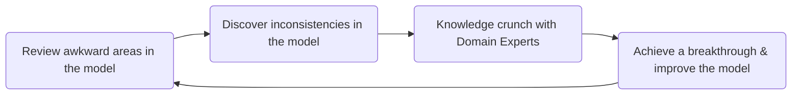

Like agile development, we start with something rough, then iteratively refine our understanding, sometimes achieving breakthroughs. This process gradually moves the software towards better serving the Domain.

### Again, communication is key

Perhaps you have heard about techniques or ceremonies to extract Domain knowledge, such as Event Storming. 

I would like to stress again, that communication is key. Techniques such as Event Storming may bring structure to your meetings, but they are not a requirement. Do not put too much weight on them and be flexible. 

As long as we gain knowledge, it does not matter much which technique we use. 

## The DDD architecture

With all that prep talk out of the way, how do we distill our Domain understanding into a design? Ultimately, we need to understand the concepts, and the business rules governing those concepts.

To do that, I believe that there are 3 main components in a DDD architecture.

- The Domain Model
- The Domain Service
- The Anti-corruption Layer (Optional)

### The Domain Model

Whenever I start designing for a new project using DDD, this is the first thing I'd sketch up. It is the most important thing in DDD.

The concepts and business rules of the Domain is distilled into a **Domain Model**. It is almost similar to a relational database schema, but way more abstract, with business logic inside them. **They are full-fledged abstractions of real life Domain objects with their behaviour (a.k.a. business logic) encoded within.**

DDD asks that we must always ensure consistency and protect the integrity of the Domain Model. That means ensuring that all the business logic are properly encoded.

For example, from speaking to the Domain Experts, we learned several rules the Customer Data context:

- Each Customer should be unique and identifiable. There can't be duplicate Customers.
- Each Customer should have at least 1 or more Addresses assigned.
- Each Customer can have 0 or more Orders assigned.
- Addresses and Orders are for display purposes only, they don't have to be unique and identifiable.

Note that these rules apply only to the Customer Management context. They will be different in another context, such as the Order Shipment context, where we don't care about Customers as much as Addresses and Orders.

So in our Domain Mode for the Customer Management system, the Customer, Address and Order classes should have logic to satisfy all of the above rules.

In DDD, there are several tools to help us with building this. They consist of **Entities**, **Value Objects** and **Aggregates**.

#### Entities, Value Objects and Aggregates

**Entities are mutable objects with an identity**. Entities are mutable except for their ID. An example is Customer, where each instance of it corresponds to a real Customer of the App. In real life, each person can be identified by their social security number. In the same manner, our Domain Expert might want each Customer to be identified by, for instance, its UUID. This is therefore reflected in our model.

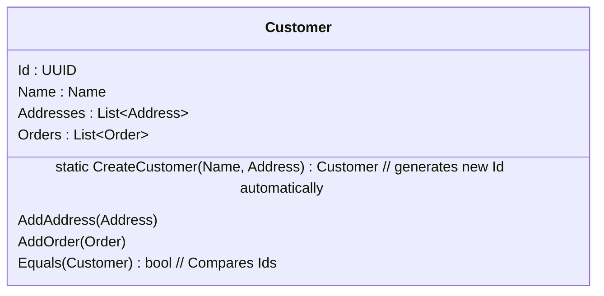

Entities need to have their integrity ensured at all times. Operations on Entities should always ensure that no inconsistencies can rise. Because of this, Entities are inherently complex and not everything should be entities.

What determines that an Entity is consistent? The Domain's **business rules**.

**Value Objects are immutable objects without an identity**. An example is Customer's Name. There is nothing special about a Name, it is only so that the software knows what to put in the Customer's invoices. In fact, 2 Customers can even share the same Name instance. Changing the Name of one Customer will not affect the other, due to Name being immutable and we just replace the whole instance. Value Objects are inherently much simpler than Entities. 

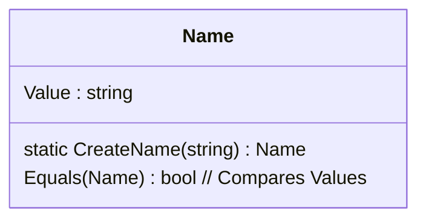

Another way to think of Entities vs Value Objects is to imagine implementing an equal comparison. We don't have to do this, but if we did, for Entities we would compare their IDs, whereas for Value Objects, we'd compare the attributes.

Value Objects also may contain business rules, but they should be vastly simpler.

> Now you might think, since Name has no business logic, why the need of a whole object here? We can't just use strings directly? There are benefits of using Value Objects even for simple attributes such as Name:
> - No ambiguity when reading code, as the type is spelled out instead of being just a generic type.
> - If in the future we need to change or add a new attribute to the Value Object, it's done in 1 place.
> - In languages such as C# .NET, you can use structs for Value Objects, so that they are initialised in stack instead of heap memory, removing the garbage collection penalty. 
>
> Having said that, I feel that we can be flexible, especially for single attribute values that we know won't ever change. Or if we care more about time-to-market than longevity.

Something can be a Value Object within a context, but an Entity in another context. It depends on whether or not the identity of that object is important for that context. This is called a _Bounded Context_, which I will describe later.

<table>
<tr>
<th> Customer Management System </th>
<th> Order Management System </th>
</tr>
<tr>
<td>

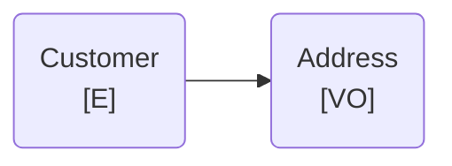

</td>
<td>

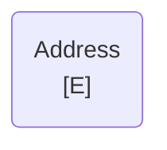

</td>
</tr>
</table>

For example, the Customer's Address is a Value Object in the context of the Customer Management system. However, for an Order Shipment system, the Address might be an Entity, since it is important to the shipment of the order.

**Aggregates are groups of related Entities and Value Objects**. Since these objects are related to each other, they naturally falls in a hierarchy, and the top should always be an Entity.

An Aggregate can be thought of as a big & complex Entity. There's the usual suspects of being an Entity, any operation done to it must ensure its internal consistency, a.k.a. the business rules. This is why an aggregate should only be accessed through the top level Entity. Bypassing this would potentially bypass important internal logic.

Also, an Aggregate can be contained inside another Aggregate.

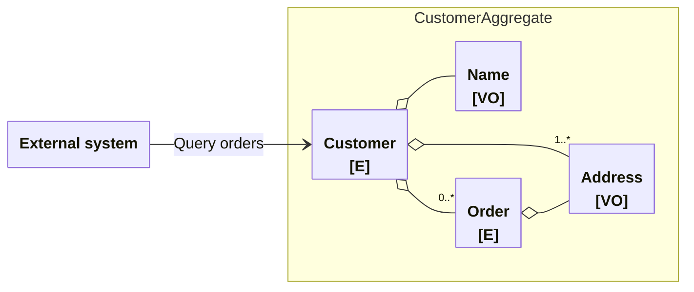

In the end, these are tools to help us distill the knowledge into code. They are helpful because they explicitly encode the rules that usually show up in many Domains, such as identity and immutability. 

But I believe that tools are still tools, and we are not forced to use them to create a successfully Domain Model, as long as our model truly reflects the Domain knowledge.

OK, now that we've covered the most important topic which is the Domain Model, let's look at the stuff surrounding the Domain Model, supporting its function.

### The Domain Service

So far we've had things that have attributes, like real life objects. They are stateful. Very frequently, there will be logic that won't directly need to know these states. In such cases, we put it in a Domain Service. 

For example, the Order Shipment system might need the capability of calculating the cost of shipping an Order to an Address. This logic might internally calculate the dimensions (size and weight) of the shipment, the length of the journey, and ask an external system for the cost of making such a journey.

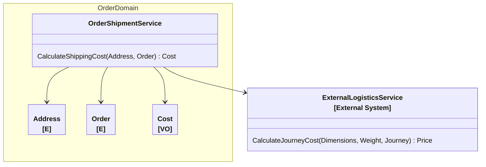
The OrderShipmentService takes in some Domain inputs and gives an output, there is no state. This is how a Domain Service should be. 

_A Domain Service should contain logic related to the Domain, and be stateless._

If you find yourself with a stateful Service, maybe it's time to think deeply and identify a missing concept in your Domain Model, perhaps a missing Entity. 

In the above example, our Domain Service interacts directly with an external system, so there's a chance it has to deal with foreign concepts, such as Dimensions or Price, which may exist in our Domain Model in different forms. In such cases, there is a need for Adapters. 

If the external systems are stable, well designed and well documented, it is usually not an issue. Sometimes, it is an issue, such as when integrating with a legacy system. In such cases, we might need an **Anti-Corruption Layer**.

### The Anti-Corruption Layer

This is an optional layer that protects the Domain from being polluted with unwanted things from an external system, hence "anti-corruption". It sits between the external system and our Domain Model, and adapts all requests, inputs and outputs between the two, using a set of Providers and Adapters.

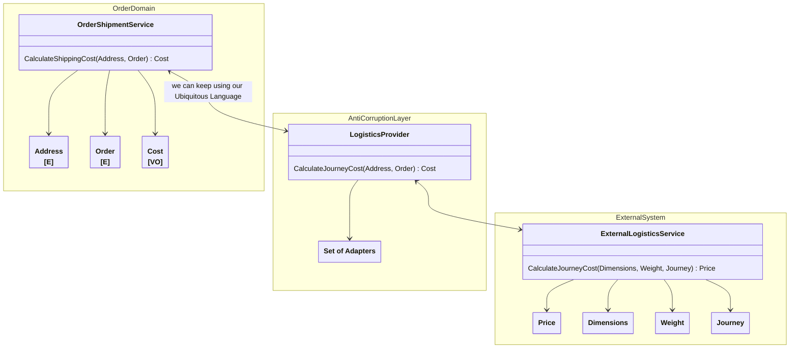
In the example above, Price, Dimensions, Weight and Journey will be stopped at the Anti-Corruption Layer and will not appear in our Domain Service. 

> By the way, this is taking a page out of [Hexagonal Architecture](https://en.wikipedia.org/wiki/Hexagonal_architecture_(software)) for loosely coupled components.

This obviously comes at a cost of complexity. Maintaining a set of adapters can be tedious work. It can be lessen somewhat with AI nowadays, but there is still the risk of something breaking. We should use this only when necessary, such as when integration with a legacy system is an absolute must.

### The Bounded Context

After all of that technical architectural stuff, we are back to conceptual thinking again.

When we communicate in life, there's always a context to everything. Knowing what the context is can totally change the meaning of phrases or even words.

> The word "season" can be used to describe the weather patterns, but in another context, it becomes the action of spicing up your food!

**A Bounded Context is a defined abstract boundary which groups together a bunch of Domain Models related to each other, where the same Ubiquitous Language applies**. 

Outside of that Bounded Context, we are in another Bounded Context where other Domain Models apply, with a different Ubiquitous Language.

It's important to always be aware of the Bounded Context during communication, and make things consistent. At the same time, we should not be distracted by things going on in other Bounded Contexts.

So how do we draw up a Bounded Context? Do we just have a Bounded Context around each Domain? Doesn't it sound like the same thing as a Domain if it's just a 1-1 mapping?

Well, that's one way to do it. In the example below, we do just that, have a Bounded Context for Customer Data Domain and one for the Order Shipment Domain.

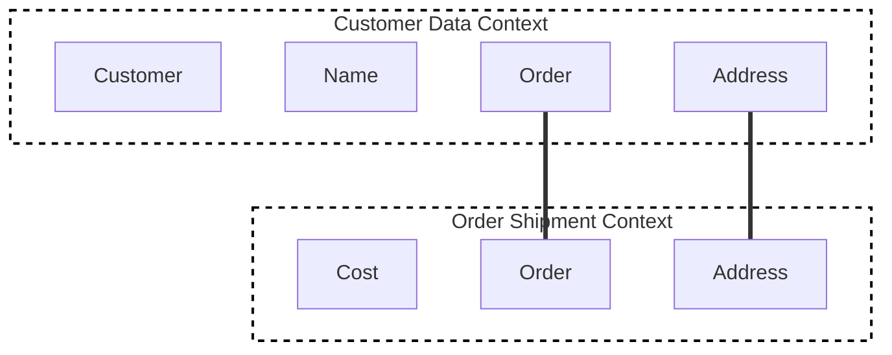
We might find out that there are Entities and Value Objects that appear in both Contexts, Order and Address in this case. To address this, we might choose one of the below:

- Use adapters. Insert an Anti-Corruption Layer in between.
- Declare that Order and Address are indeed sharing the same meaning between the two Contexts, and put them in a **Shared Kernel**, i.e. a shared federated library.
- Declare that the Customer Context has the power to control Order and Address, and the Order Shipment Context must conform. This is called the **Conformist** approach.
- Declare that the Customer and the Order Shipment Contexts should no longer have anything to do with each other, and split out totally, each going its **Separate Ways** (the name of this approach). This means each Context will find its own solution to fill in the gaps created by the separation.

As you can see, when we make decisions like these, we are reshaping the Bounded Contexts as well as the Domain Models. Which ties into my prior statement that DDD is an iterative process.

I would say that Bounded Contexts are usually not a 1-1 mapping of Domains, due to all the intricacies described above. It must keep all the relevant Models together, and the ability to draw up the boundaries comes with experience and business knowledge. 

As devs and architects, I don't think we need to know too much about how to draw up the Bounded Contexts. That's again the job of the very senior person who knows a lot about the business. The important thing is to always be aware of the drawn up Contexts as we go along.

### That's most of it, really!

With that, we have described all the most important parts of a DDD architecture. 

There are some more tools that the blue book wants us to know, such as Factories and Repositories. Factories are in charge of creating the Entities and Value Objects, and Repositories abstract away the storage and retrieval of them.

In my humble opinion, they are supplemental rather than necessities. They don't add much value for instilling the Domain Model with business rules. So I would apply KISS here and use them only if necessary.