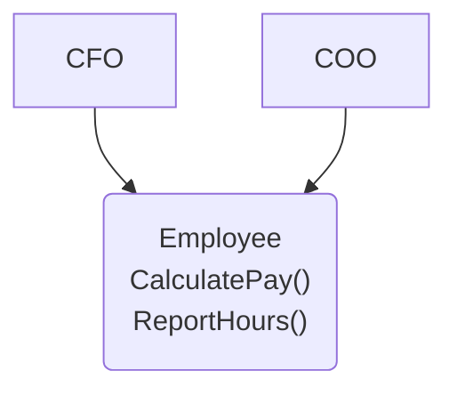
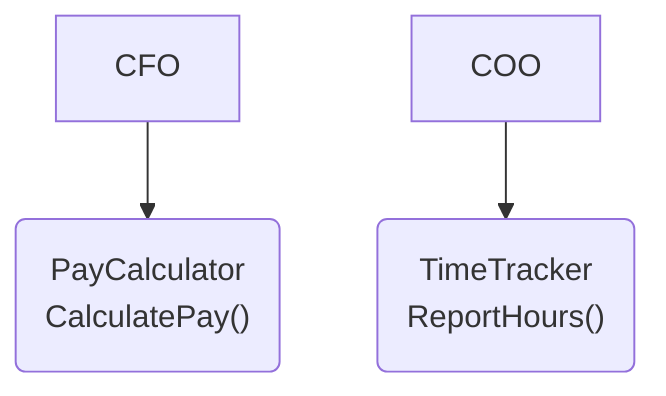
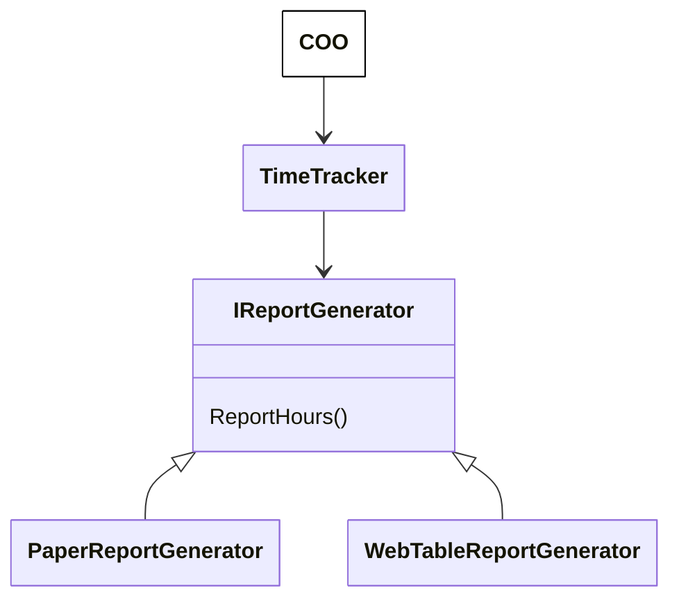
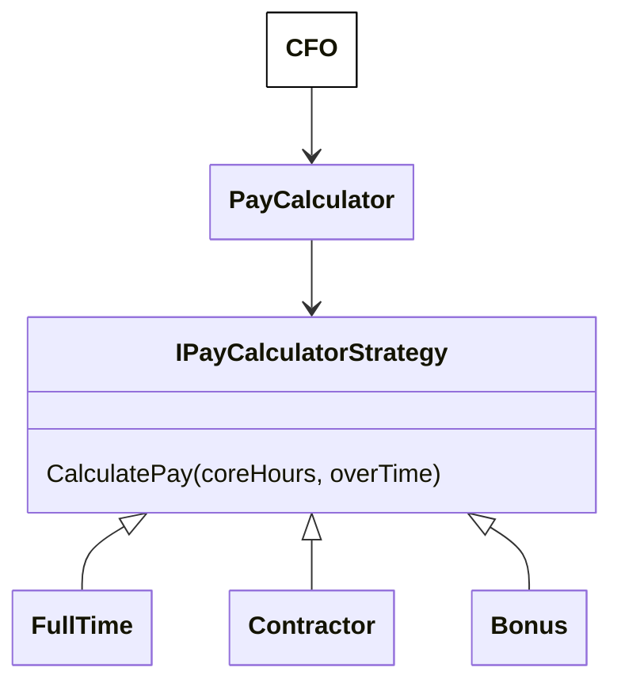
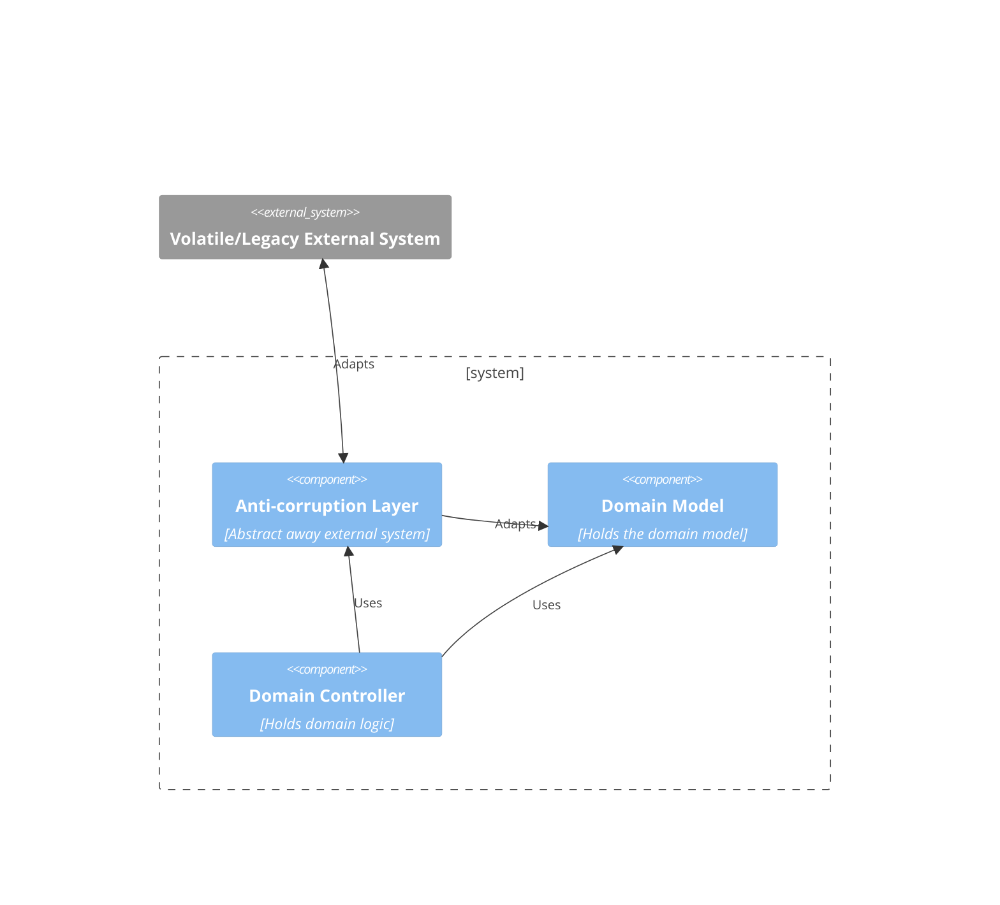
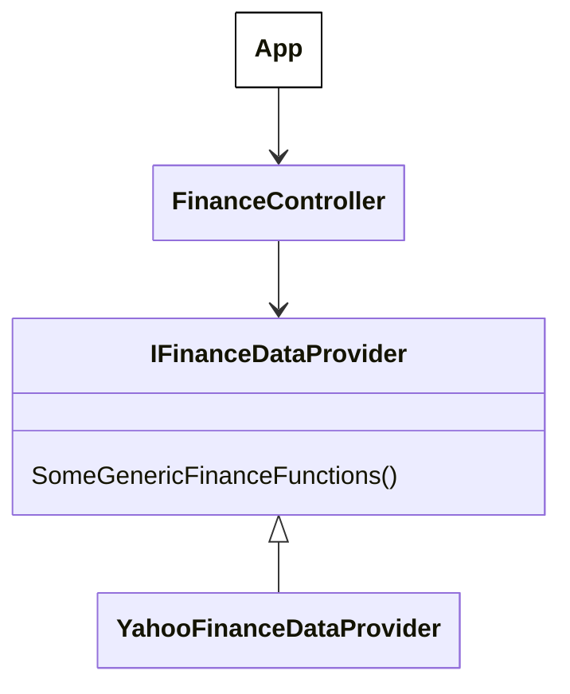

[Back](./README.md)

# SOLID

Chances are that SOLID principles are already coursing through your veins, if you truly care about writing sustainable software. Therefore, this section aims to go more deeply into the essence of each principle, rather than rehashing the face definitions.

## Single Responsibility Principle (SRP)

The standard definition is:

> A module should have one, and only one, reason to change

### What are modules and components

In OOP, a module is defined as a “class” in the classical (pun intended) interpretation.

This definition however raises more questions than it answers. Is a module always a class? What about a function? Or a structure bigger than a class?

Let me put my personal definition down:

**_A module is a cohesive set of classes, functions and data structures (or simply source files)._**

**_A component is a cohesive set of modules._**

So components are higher level than modules, and architects like me usually deal with components. However, the terms “module” and “component” are usually used interchangeably at my work. We’ll soon find out that SOLID principles apply to both unconditionally.

### The recursive definition

The word “cohesive” implies SRP. So what this really says is that a module satisfies SRP if it satisfies SRP!

Consider it this way, if the rules of what should be in a module to satisfy SRP were logical and precise, a robot could do our jobs. As software architects and principles are experienced developers first and foremost, we need to use our intuition to judge.

Perhaps the more important question then is “what counts as a reason to change?”. This can easily misdirect inexperienced developers into thinking that the whole module should just do "one thing". To make matters worse, the granularity of that “one thing” varies between levels of understandings of different developers. So what is that "one thing", exactly?

Here uncle Bob says

> A module should be responsibly to one, and only one, actor

An **Actor** can roughly translate to a group of **Users** or **Stakeholders** of the module. This can be real people, or it can be abstract such as other modules. This is somewhat clearer but still abstract and open to interpretations.

Perhaps the best way to understand this principle is to look at an example of violation.

### Example

Consider a payroll system that supports 2 actors.



- The CalculatePay() method is used by the CFO for his financial reports.
- The ReportHours() method is used by the COO to manage operations.

This module violates SRP. By having 2 separate actors, it couples them in a way that one change in the system will affect both of them.

Let’s imagine that there is some common logic shared between the 2 above methods. Any change to that common logic will need to be carefully tested for both the CFO and the COO’s use cases, no matter from whom the change was requested.

Even worse, let’s imagine that the CTO and COO have both made a feature request. The dev team has 2 concurrent branches that make changes to the same code. This is risky and will likely lead to merge conflicts. At best, this is caused by careless developers, and at worst it may represent conflicts of interests between the CTO and COO.

We will explore the solution in the next section on OCP.

## Open-Closed Principle (OCP)

This principle says

> A software artifact should be open for extension but closed for modification

**This means we should be able to extend the behaviour of the software module without having to modifying existing parts of it.**

The significance of this principle is widely understood by most developers. However, some might not realise the connection between this and SRP. How? In order to reduce the amount of changed code to a minimum, we need to properly separate the things that change for different reasons.

**_In other words, OCP is an extension of SRP. When SRP is violated, OCP likely is as well_**. (And we will soon learn that it is related to the Dependency Inversion Principle (DIP) too)

But then, what exactly does _“extension”_ and _“modification”_ mean?

Within a module, this could be adding new code vs changing existing code. It could also mean changing shared code that affects places which should not have been affected. Between modules, this could be incompatibility in the form of compilation or runtime errors.

A rule of thumb is to look at the testing required to test the work. If it involves more flows and components than necessary, then we potentially have a violation.

To demonstrate this, let’s look at an example of violation.

### Example

First we can look at the same example as before:


In the above example, we have 1 class that handles 2 responsibilities, violating SRP. Because of that, when one of the responsibilities needs a few feature, the other one is affected, thus violating OCP.

Now, the solution to satisfy SRP is to split it into 2, PayCalculator and TimeTracker.



This is better because any change to the PayCalculator will not affect the TimeTracker and vice versa. However, this is still incomplete. Let’s dive in deeper.

Let’s say the COO only requires the TimeTracker to generate hour reports in one format, as a table on a traditional sheet of paper, with no colours other than black and white. If that never changes, the TimeTracker class is OK to have the report generation logic built-in. Or to fully satisfy SRP, in a separate concrete ReportGenerator class.

The year 2000 came and the COO now wants a fancy HTML table with many colours and effects, in addition to the paper report.

The TimeTracker/ReportGenerator class now violates OCP, because it will need to change existing code in order to add the new web report functionality.



In order to avoid that, we introduce a layer of abstraction called IReportGenerator.

With this, our TimeTracker class is fully compliant with OCP and SRP, as no matter how many other forms of report the COO needs, we can simply add a new implementation of IReportGenerator without modifying any existing classes.

### The direction of stability

We say a module or component is stable if it’s resistant to change. We're not talking about the _frequency of change_, but _how easy it is to change_. A coin standing on its side is not changing, but we can't say that it is stable.

We all know that there are certain types of modules or components that should be inherently more stable than others. For instance, modules that contain business rules should be more stable than ones that deal with the UI. A successful architecture will ensure that this relationship is maintained.

Pay attention to all the arrows on the diagram (with the exception of the one from the COO). Most of us are already aware that they denote **dependencies**. The more arrows pointing at a box, the more boxes depend on this box. It’s easy to see that changes in this module will affect all the modules that depend on it. Hence, the module is resistant to change.

_In essence, the more depended upon a module is, the more **stable** it becomes. So the direction of the arrows denote the direction of stability._

This has several indications:

- Modules that contain important business logic should be stable, so the direction of stability should go towards them.
- Stable modules should only depend on even more stable ones, not the other way around.

So what can we do to ensure that this is obeyed?

The inheritance arrows from the concrete generator classes pointing upwards are an example of **Inversion of Control**. We introduce an abstraction, which inverts the direction of stability. Without this, the arrows would be pointing towards the concrete report generator.

As you can see, in order to maintain the OCP, we should ensure that the SRP is obeyed by implementing the DIP.

## Liskov Substitution Principle (LSP)

This is one that has a funny looking box-standard definition, so I would rather put my own “translated” version here

> The user of an abstract module should not care about the implementations of said module

Although this principle originally talks about inheritance directly, we can extend our understanding of it to higher levels of abstractions.

This principle is basically SRP applied to the user of abstract entities.

If we follow this principle properly, it prevents changes in the lower level implementations from affecting higher level entities.

Experienced developers will most likely have realised that there are more than one way we can violate this principle. Here are a few ways:

- Improper inheritance, where the subclass is not truly a “kind-of” its abstraction.
- Improper inversion of control, where the user of the abstraction directly or indirectly knows about the implementations.

Let’s try looking at an example of violation.

### Example

Let’s consider a pay calculator system for our CFO.



To have the ability to calculate pay for different types of employees, we use the strategy pattern and create an interface **IPayCalculatorStrategy**.

For simplicity, this only takes 2 arguments, the number of core hours and the number of overtime hours that the employee did for the month.

Among the implementations, the ones for full time employees and contractors are valid strategy concretes, **as long as they both satisfy the basic constraints of their parent.**

For example, since this example company is in the 21st century, the CFO institutes that no matter how your pay is calculated, it will increase along with the number of hours you do. So the PayCalculator might have a unit test that reflects this. Both the FullTime and Contractor concretes are valid if they satisfy this basic requirement.

The CFO decides that everyone will have a bonus, which is only decided by the company’s overall performance. So the Bonus class does not satisfy this requirement. As a result, our unit test now fails if Bonus is the concrete. At the same time, Bonus is a “kind-of” IPayCalculatorStrategy, it does not even make use of the method arguments.

As a result of this, the PayCalculator needs special logic for dealing with Bonus, like such:
```
if (strategy is Bonus) { ... }
```

The fix in this case is to remove Bonus from this hierarchy and find another way to fit this functionality in. Perhaps have an IBonusCalculatorStrategy on the same level as IPayCalculatorStrategy.

### Appendix

The standard definition of Liskov Substitution Principle:
Appendix
The box-standard definition for reference:

Subtype Requirement: Let 𝜙(𝑥) be a property provable about objects 𝑥 of type T. Then 𝜙(𝑦) should be true for objects 𝑦 of type S where S is a subtype of T.

Symbolically:

𝑆 ≤ 𝑇 → (∀𝑥:𝑇.𝜙(𝑥) → ∀𝑦:𝑆.𝜙(𝑦))

## Interface Segregation Principle (ISP)

The standard definition of this principle is

> No code should be forced to depend on methods it does not use.

If you just read this sentence and don't think much of it, you might not realise that the essence of this principle directly ties into SRP. 

Let me first remind that SRP says that **a module should be responsible for only one actor**. This means that all the public methods on that module should serve only one actor alone. From the perspective of the actor, the module that it depends on should not serve other actors. 

If this principle is broken, this module will now have multiple reasons to change, due to serving multiple actors, each actor trying to influence the module to serve its own needs.

So, this principle is actually SRP from another perspective. To better understand, let's look at the SRP example again.

### Example


- The CalculatePay() method is used by the CFO for his financial reports.
- The ReportHours() method is used by the COO to manage operations.

Consider that the CFO only needs CalculatePay(), and the COO only needs ReportHours(). If the CFO requires a change in CalculatePay() resulting in a new version that needs to be deployed, the COO now needs to take the new version containing changes that he/she does not care about.

Likewise, imagine that the CFO's team decides to switch from C# .NET to Java, and puts pressure on the team who owns the Employee package to switch as well. Now this team faces a conumdrum, since whatever they'll decide to do, they will disappoint at least one of their customers.

The solution to this is the same as SRP, split the package by actors.


## Dependency Inversion Principle (DIP)

This principle is probably the most straightforward among SOLID principles, since I have never encountered a developer who grossly misused this principle.

It states that

> - High-level modules should not import anything from low-level modules. Both should depend on abstractions (e.g., interfaces).
> - Abstractions should not depend on details. Details (concrete implementations) should depend on abstractions.

Seems easy enough, always depend on abstractions, not the other way around. Good for testing. I'd like to expand and claim that there is a deeper meaning to this than meets the eye.

Think of the **direction of stability**, which I explained in the section about OCP. The arrow of dependency should point towards more and more stability. This applies not only between modules, but also within a module. Concrete implementations are in general less stable (i.e. more prone to changes) than interfaces, so the arrow should go from the concrete to the abstraction.

This principle therefore applies not only at the code level, but also the architecture level, since the concept of direction of stability is valid throughout. 



For instance, in _Domain Driven Design_, when designing a module that has to interact with an external system, we need to answer a few questions about that external system, **how stable is it**, whether its model contains inconsistencies with our model, etc. If we find the answer unsatisfactory, we add an **Anti-Corruption Layer**, which is meant to abstract away this system to protect the rest of our model from it.

DDD also talks about having a constantly evolving Domain Model. The idea is that our design is rarely perfect in the beginning, but we make discoveries and breakthroughs over time by analysing the domain and achieving a higher understanding of it. In my opinion, this is what helps us identifies abstractions, enabling us to apply DIP.

### Stability of expectation

This stability applies not only to the rate of change of the system that we use, but also to our expectations of it.

I'm alluding to _the ability to independently vary the implementation of the system without affecting the rest_.

In OOP, **inheritance** is the main mechanism for this. In high level architecture, we have the same concept with _ports_, _adapters_ and similar. It gives the software more flexibility, to delay the choice of implementation until later. 

_We do this when we understand that our expectation of the system we depend on is unstable_.

So the DIP principle is not only about protecting our software from volatile systems, but also to protect it from our own volatile expectations. Should the expectation be stable, we would know for sure that our system would always use this specific implementation, and there would be no need for an abstraction.

### What if it's already stable?

What about when the thing we depend on is stable, do we **forgo** DIP? 

The answer is yes, in general. It is normally widely accepted that we can directly use the implementation of String in .NET or Java without consequences, as we know it is extremely unlikely to change. The same thing applies to high level architecture, adding an additional layer of abstraction always adds complexity which requires maintenance.

### Testability

However, we should not get carried away and remove all abstractions, as we need to ensure that the system is testable.

You don't need to abstract String away, but other things such as network calls should be mocked in tests. And of course this applies to all things that are not stable.

### Example

Instead of directly calling Yahoo Finance APIs in your app's main logic, make an abstraction called IFinanceDataProvider with generic functions that your app needs, and an implementation using Yahoo Finance APIs. 

By generic functions, I mean those that are commonly seen across many Finance Data Providers and not specific to Yahoo. Chances are that your app's main logic will continue to function just fine with these generic methods. 



If your app's main logic somehow is tightly coupled to Yahoo-specific functions that cannot be found else where, it gets interesting. You have a choice:
1. Declare that your app is forever tied to Yahoo Finance, and make your abstraction Yahoo-specific, i.e.  IYahooFinanceDataProvider. If the Yahoo Finance APIs are stable and you don't see a need for testing (I wouldn't recommend it), you can even forgo the interface.
2. Rigorously study the problem you are trying to solve to see if you have missed something. You might learn something that can remove the tight coupling.

Option 1 is much easier than option 2. But in order to achieve a better design, the 2nd option is needed most of the time. That's not to say that option 1 is always invalid, especially if you've already gone through option 2 and found that this tight coupling is absolutely essential to the problem you are solving.

