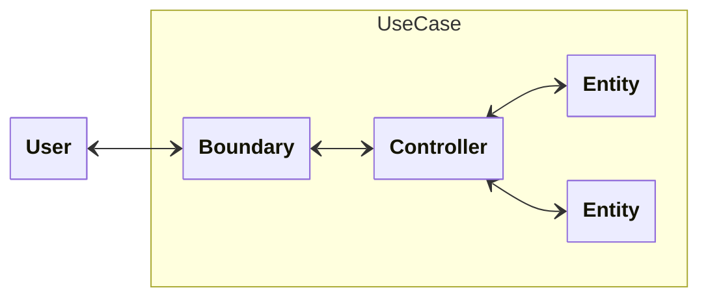
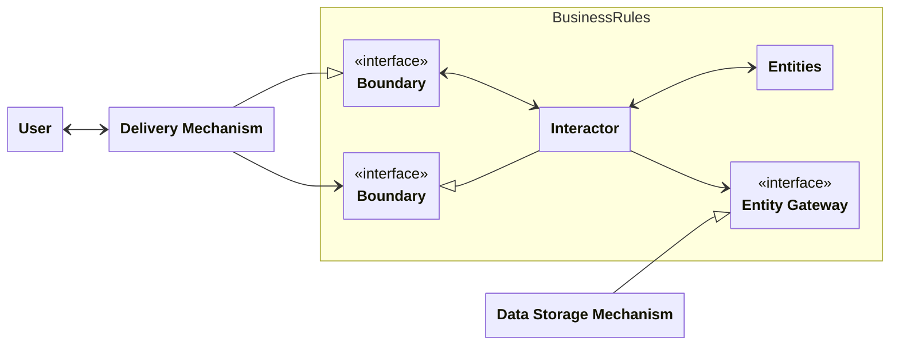
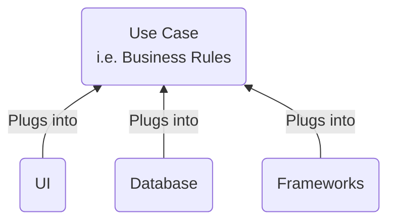
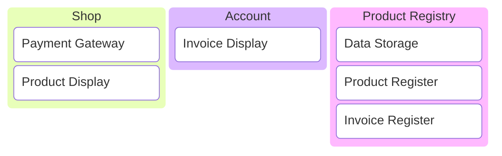
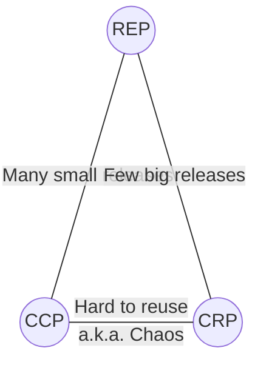

[Back](./README.md)

# Clean Architecture

## Preface

Clean Architecture was spearheaded by Robert C.Martin, a.k.a. Uncle Bob. It is all about designing software that's loosely coupled, because it enables us to more easily test the software and make changes later down the line. It teaches us a set of principles that aligns us towards that goal.

I'll borrow one of the chapter openings from the Clean Architecture book by Robert C. Martin, which is where I learned these principles from. 

> If the SOLID principles tell us how to arrange the bricks into walls and rooms, then the component principles  tell us how to arrange the rooms into buildings. Large software systems, like large buildings, are built out of smaller components.

So if we know how to build good components and put them together, we can build large software systems.

## The Essence of Clean Architecture

### How it all started

At the beginning, software engineering was very different. Code was structured around technicalities and hardware limitations. It is understandable since computers and toolchains were very limited back then.

This was the norm for a very long time. Even now, it still exists. If we look at the folder structure of an MVC project, it would probably be something like:
```
Models/
Views/
Controllers/
``` 
It immediately tells us that this is an MVC project, but it tells us nothing about what it does. The code is organised around the framework (Web in this case), not the application itself.

_Clean Architecture says that this is wrong. The code, and the architecture of a piece of software should tell us what it does, not which technology it uses._

This work builds upon Ivar Jacobson's work in _Object-Oriented Software Engineering: A Use Case Driven Approach_. In case you didn't know, Use Case, User Story, Capability, they all mean the same thing, a piece of functionality of the software. For a shopping app, we could have a Use Case of "Creating an account" or "Purchasing a product" for example.

In Ivar's work, he laid out that a Use Case can be represented by an object. This object, called a Controller, would contain and orchestrate all the business logic necessary to fulfill the Use Case. The Controller would control the data flow in and out of Entities, which are smaller units of business rules. A Boundary Object sits between the Controller and the rest of the world, abstracting the IO away from the business rules.


```mermaid
---
  config:
    class:
      hideEmptyMembersBox: true
---
classDiagram
  direction LR
  class U["User"]

  namespace UseCase {
    class B["Boundary"]
    class C["Controller"]
    class E1["Entity"]
    class E2["Entity"]
  }
  U <--> B
  B <--> C
  C <--> E1
  C <--> E2
```
This was groundbreaking! For the first time, software engineering focused on business behaviour rather than technicalities, such as the framework or database, with the introduction of Use Cases.

Uncle Bob took this and went one step further. The Controller is renamed to Interactor to avoid confusion with MVC. The Boundary becomes clearer as an abstraction for a Delivery Mechanism, to get data in and out of the Iteractor. We have a special Boundary called Entity Gateway abstracting away the data storage mechanism.


```mermaid
---
  config:
    class:
      hideEmptyMembersBox: true
---
classDiagram
  direction LR
  class D["Delivery Mechanism"]
  class U["User"]

  namespace BusinessRules {
    class B1["Boundary"] { <<interface>> }
    class B2["Boundary"] { <<interface>> }
    class I["Interactor"]
    class E2["Entities"]
    class Eg["Entity Gateway"] { <<interface>> }
  }

  class Egi["Data Storage Mechanism"]

  U <--> D
  D --|> B1
  D --> B2
  B1 <--> I
  B2 <|-- I
  I <--> E2
  I --> Eg
  Egi --|> Eg
```

Even though this explanation is an oversimplification, it still highlights the ultimate goal: **to focus on the business logic and delay everything else until later**.

My favourite quote from one of Uncle Bob's presentations:

> The job of the architect is not to make decisions. It's to defer decisions as long as possible, to allow the application to be built in the absence of decisions, so that the decisions can be made later with the most possible information.

There are some decisions that has to be made, such as what language to use. Apart from those, we can defer decisions such as what database or what UI technology we are using, etc.

> Even when we know what database we are using, because our company has invested $20 million into a useless license for some database, we can still pretend that we don't know and defer that decision.

Imagine something akin to a Plugin Model.


```mermaid
flowchart BT
  U("Use Case<br/>i.e. Business Rules")
  UI("UI")
  D("Database")
  F("Frameworks")

  UI & D & F --> |Plugs into| U
```
We don't want our Use Case code to know about the UI or the Database, as well as which DI framework we use. Because Frameworks will eventually screw us. 

Framework authors have their interest in mind, not ours. They are a completely different team, different organisation, different goals. They have no commitment to keep their code in alignment with our goals. The same thing applies to UI, Database and all other details.

Uncle Bob even went as far as recommending us to be wary of the framework author's code examples, because they have incentives to make our apps strongly coupled to their frameworks.

When our focus is in the Business Rules, we can bring them out in front. The unimportant technical details are delayed, and the important business problems are tackled first. Our folder structure would look more like:

```
CreateAccount/
Login/
MakePurchase/
ViewOrderSummary/
```
instead of 
```
Models/
Views/
Controllers/
``` 

This is the essence of Clean Architecture.

### The rise of the principles

Designing software is complex. For a lot of us, simply stating to delay decisions till later won't tell us what to put inside a component. Using this essence as the navigational compass, Uncle Bob extracted a set of principles that should help makes this task easier.

These include the [SOLID principles](SOLID.md), and the Component Cohesion and Coupling principles.

Here is an example to demonstrate.


```mermaid
---
  config:
    class:
      hideEmptyMembersBox: true
---
classDiagram
  direction LR
  class D["Delivery Mechanism"]
  class U["User"]

  namespace BusinessRules {
    class B1["Boundary"] { <<interface>> }
    class B2["Boundary"] { <<interface>> }
    class I["Interactor"]
    class E2["Entities"]
    class Eg["Entity Gateway"] { <<interface>> }
  }

  class Egi["Data Storage Mechanism"]

  U <--> D
  D --|> B1
  D --> B2
  B1 <--> I
  B2 <|-- I
  I <--> E2
  I --> Eg
  Egi --|> Eg
```

Notice that the arrows that go from the outside to the inside, all point inwards? 

Let me make it even more clear:


```mermaid
flowchart BT
  U("Use Case<br/>i.e. Business Rules")
  UI("UI")
  D("Database")
  F("Frameworks")

  UI & D & F --> |Plugs into| U
```
Instead of the Business Rules having a direct dependency on a particular Database implementation, we create an abstract Boundary called the Entity Gateway that inverts this relationship. This is called the _Dependency Inversion Principle_, one of the SOLID principles.

If we apply this principle correctly, the arrows will always point towards more stability. This is called the _direction of stability_.

At this point, you are probably starting to see the connection between the essence of Clean Architecture and the SOLID principles, if you have read my [SOLID principles page](SOLID.md).

The SOLID principles are derived from Clean Architecture. They apply to code as well as high level architecture. In my opinion, these principles should be enough to design great software.

But to aid ourselves further, Uncle Bob gave us two more sets of principles, **Component Cohesion** and **Component Coupling**, which are derived from SOLID principles.

## Component Cohesion

These principles tells us how to group things into a Component to achieve **high cohesion**.

### Reuse/Release Equivalence Principle (REP)

> The unit of reuse is the the unit of release.

This statement may sound abstract at first, so let me break it down. It has a double meaning.

The first one is very straight forward. It simply says that code should be reused through tracked releases, not through copy/paste. Any decent developer would know this. Tracked releases let the user know that classes and modules that are released together are compatible.

The second meaning is more subtle and important:

Classes and modules within a Component should be **_releasable_** together. 

They must **_make sense_**. 

There should be an **_overarching theme_**.

How do we decide what makes sense and what constitutes an overarching theme? A lot of it will come from SOLID principles and experience. Also, the next 2 principles will aid us further with this.

### Common Closure Principle (CCP)

> Group together things that change for the same reason and at the same time.

This tells us what to put inside a Component. Classes and modules that serve the same actor, as they will change for the same reason at the same time. 

It is SRP applied to the Component level.

By straying away from this principle, we'd get:
- Less maintainability, more workload
- Classes and modules in the Component **_don’t make sense_**


```mermaid
kanban
  [Shop]
    [Payment Gateway]
    [Product Display]
  [Account]
    [Invoice Display]
  [Product Registry]
    [Data Storage]
    [Product Register]
    [Invoice Register]

```

### Common Reuse Principle (CRP)

> Don’t force users to depend on things they don’t need.

This tells us what **not** to put inside a Component. Classes and modules that are not often used together.

It is ISP applied to the Component level.

Otherwise, we'd get:
- Unstable Component, too many unneeded releases
- Classes and modules in the component **_don’t make sense_**

### The Triangle of Tension


```mermaid
block
  columns 12
  REP(("REP")):12
  space:12
  space:12
  space:12
  space:12
  CCP(("CCP")):4 space:4 CRP(("CRP")):4
  REP --"Many small releases"--- CCP 
  CCP --"Hard to reuse<br/>a.k.a. Chaos"--- CRP
  CRP --"Few big releases"--- REP
```


## Component Coupling

### Acyclic Dependencies Principle
### Stable Dependencies Principle
### Stable Abstraction Principle


## Pros and Cons
## Performance Disadvantages of Clean Architecture: A Closer Look

https://prodevperspectives.com/post/exploring-clean-architecture

Uncle Bob's Clean Architecture presentation:
[](https://www.youtube.com/watch?v=o_TH-Y78tt4)