[Back](./README.md)

# Clean Architecture

## Preface

Clean Architecture was spearheaded by Robert C.Martin, a.k.a. Uncle Bob. It is all about designing software that's loosely coupled, because it enables us to more easily test the software and make changes later down the line. It teaches us a set of principles that aligns us towards that goal.

I'll borrow one of the chapter openings from the Clean Architecture book by Robert C. Martin, which is where I learned these principles from. 

> If the SOLID principles tell us how to arrange the bricks into walls and rooms, then the component principles  tell us how to arrange the rooms into buildings. Large software systems, like large buildings, are built out of smaller components.

So if we know how to build good components and put them together, we can build large software systems.

## The Essence of Clean Architecture

### How it all started

At the beginning, software engineering was very different. Code was structured around technicalities and hardware limitations. It is understandable since computers and toolchains were very limited back then.

This was the norm for a very long time. Even now, it still exists. If we look at the folder structure of an MVC project, it would probably be something like:
```
Models/
Views/
Controllers/
``` 
It immediately tells us that this is an MVC project, but it tells us nothing about what it does. The code is organised around the framework (Web in this case), not the application itself.

_Clean Architecture says that this is wrong. The code, and the architecture of a piece of software should tell us what it does, not which technology it uses._

This work builds upon Ivar Jacobson's work in _Object-Oriented Software Engineering: A Use Case Driven Approach_. In case you didn't know, Use Case, User Story, Capability, they all mean the same thing, a piece of functionality of the software. For a shopping app, we could have a Use Case of "Creating an account" or "Purchasing a product" for example.

In Ivar's work, he laid out that a Use Case can be represented by an object. This object, called a Controller, would contain and orchestrate all the business logic necessary to fulfill the Use Case. The Controller would control the data flow in and out of Entities, which are smaller units of business rules. A Boundary Object sits between the Controller and the rest of the world, abstracting the IO away from the business rules.

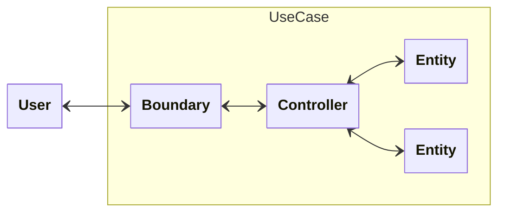
This was groundbreaking! For the first time, software engineering focused on business behaviour rather than technicalities, such as the framework or database, with the introduction of Use Cases.

Uncle Bob took this and went one step further. The Controller is renamed to Interactor to avoid confusion with MVC. The Boundary becomes clearer as an abstraction for a Delivery Mechanism, to get data in and out of the Iteractor. We have a special Boundary called Entity Gateway abstracting away the data storage mechanism.

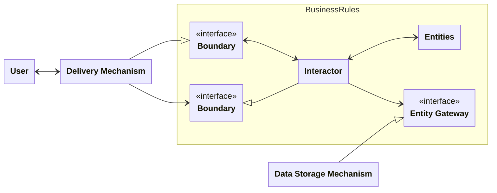

Even though this explanation is an oversimplification, it still highlights the ultimate goal: **to focus on the business logic and delay everything else until later**.

My favourite quote from one of Uncle Bob's presentations:

> The job of the architect is not to make decisions. It's to defer decisions as long as possible, to allow the application to be built in the absence of decisions, so that the decisions can be made later with the most possible information.

There are some decisions that has to be made, such as what language to use. Apart from those, we can defer decisions such as what database or what UI technology we are using, etc.

> Even when we know what database we are using, because our company has invested $20 million into a useless license for some database, we can still pretend that we don't know and defer that decision.

Imagine something akin to a Plugin Model.

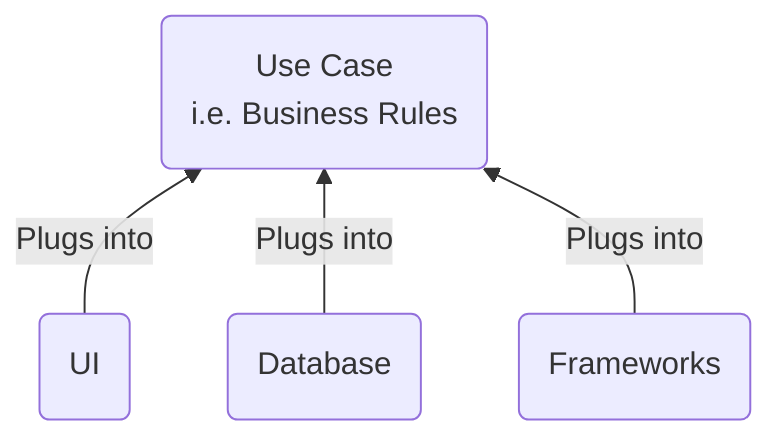
We don't want our Use Case code to know about the UI or the Database, as well as which DI framework we use. Because Frameworks will eventually screw us. 

Framework authors have their interest in mind, not ours. They are a completely different team, different organisation, different goals. They have no commitment to keep their code in alignment with our goals. The same thing applies to UI, Database and all other details.

Uncle Bob even went as far as recommending us to be wary of the framework author's code examples, because they have incentives to make our apps strongly coupled to their frameworks.

When our focus is in the Business Rules, we can bring them out in front. The unimportant technical details are delayed, and the important business problems are tackled first. Our folder structure would look more like:

```
CreateAccount/
Login/
MakePurchase/
ViewOrderSummary/
```
instead of 
```
Models/
Views/
Controllers/
``` 

This is the essence of Clean Architecture.

### The rise of the principles

Designing software is complex. For a lot of us, simply stating to delay decisions till later won't tell us what to put inside a component. Using this essence as the navigational compass, Uncle Bob extracted a set of principles that should help makes this task easier.

These include the [SOLID principles](SOLID.md), and the Component Cohesion and Coupling principles.

Here is an example to demonstrate.


Notice that the arrows that go from the outside to the inside, all point inwards? 

Let me make it even more clear:


Instead of the Business Rules having a direct dependency on a particular Database implementation, we create an abstract Boundary called the Entity Gateway that inverts this relationship. This is called the _Dependency Inversion Principle_, one of the SOLID principles.

If we apply this principle correctly, the arrows will always point towards more stability. This is called the _direction of stability_.

At this point, you are probably starting to see the connection between the essence of Clean Architecture and the SOLID principles, if you have read my [SOLID principles page](SOLID.md).

The SOLID principles are derived from Clean Architecture. They apply to code as well as high level architecture. In my opinion, these principles should be enough to design great software.

But to aid ourselves further, Uncle Bob gave us two more sets of principles, **Component Cohesion** and **Component Coupling**, which are derived from SOLID principles.

## Component Cohesion

These principles tells us how to group things into a Component to achieve **high cohesion**.

### Reuse/Release Equivalence Principle (REP)

> The unit of reuse is the the unit of release.

This statement may sound abstract at first, so let me break it down. It has a double meaning.

The first one is very straight forward. It simply says that code should be reused through tracked releases, not through copy/paste. Any decent developer would know this. Tracked releases let the user know that classes and modules that are released together are compatible.

The second meaning is more subtle and important:

Classes and modules within a Component should be **_releasable_** together. 

They must **_make sense_**. 

There should be an **_overarching theme_**.

How do we decide what makes sense and what constitutes an overarching theme? A lot of it will come from SOLID principles and experience. Also, the next 2 principles will aid us further with this.

### Common Closure Principle (CCP)

> Group together things that change for the same reason and at the same time.

This tells us what to put inside a Component. Classes and modules that serve the same actor, as they will change for the same reason at the same time. 

It is SRP applied to the Component level.

By straying away from this principle, we'd get:
- Less maintainability, more workload as changes that should have been in only one component are spread to multiple.
- Classes and modules in the Component **_don’t make sense_**.

_This principle sacrifices Reuse to promote Ease of Maintenance._

Let's look at an example of a shopping app. 
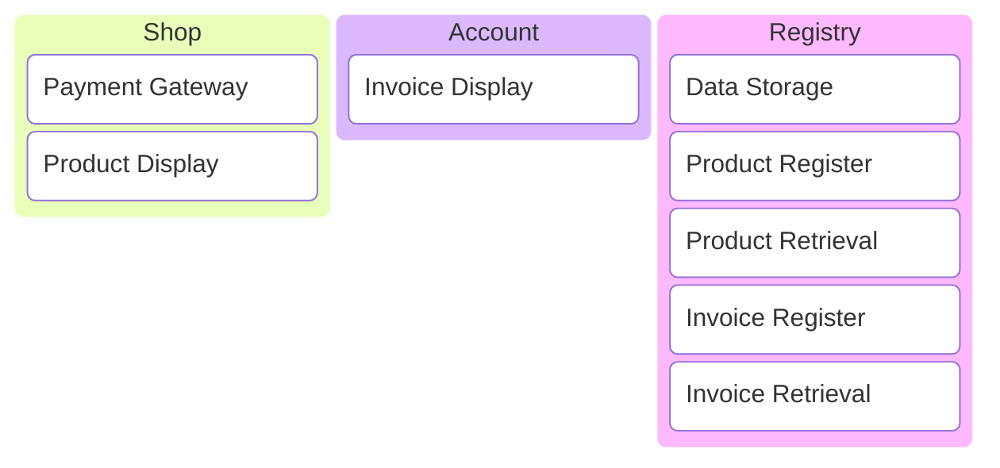
We have 3 components. The Shop is responsible for executing the Payment via a Payment Gateway, and for displaying the products. The Account component is for displaying the user's past invoices. The Registry is responsible for long term data storage, and has the ability to register new products and invoices. 

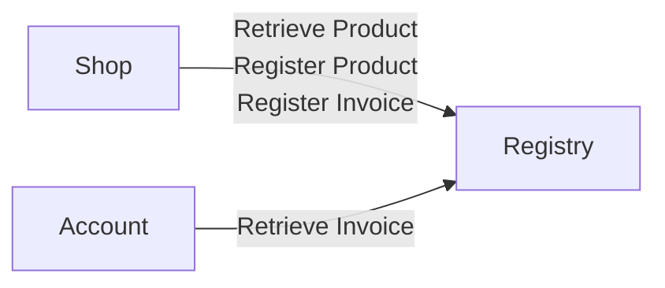

The Shop component can use Product Register to create new products. It can retrieve those products for display with Product Retrieval. It also uses the Invoice Register to create new invoices after a purchase.

The Account component can retrieve the invoices from the Registry via Invoice Retrieval.

So far so good, our system works.

Now we need to change Product, perhaps new fields should be added, or existing fields should be changed. We'd soon realise that both Shop and Registry need to change, since functions related to Product are in both.

<!-- Using 'priority' metadata field for highlighting -->
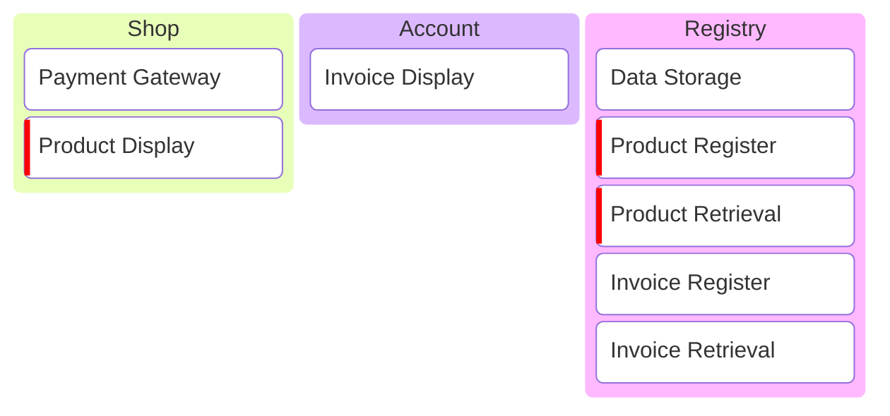

If Invoice needs to be changed as well, then all 3 components need to change.

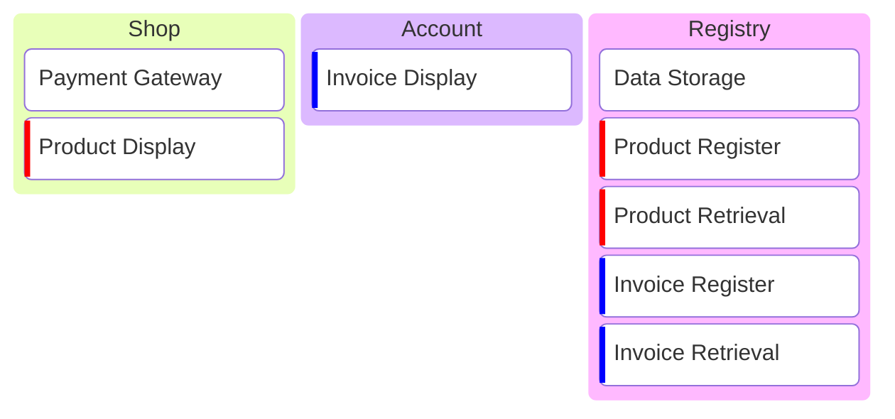

These components violate CCP. 

What would make more sense is to bring together the related function that would change together.

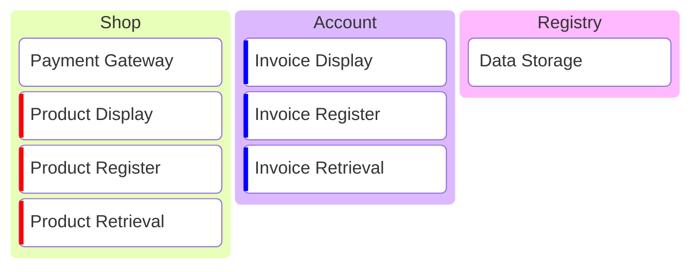

### Common Reuse Principle (CRP)

> Don’t force users to depend on things they don’t need.

This tells us to **not** put in Classes and modules that are not often used together. In other words, put in things that are often used together.

It is ISP applied to the Component level.

Otherwise, we'd get:
- Unstable Component, too many unneeded releases containing changes in things that users don't care about.
- Classes and modules in the component **_don’t make sense_**.

_This principle sacrifices Ease of Maintenance to promote Reuse._

Let's take a look at the Shop component.

Imagine that our shopping app has a new "Live Shop" feature where influencers would do live streams and sell their own products using the Payment Gateway that our app provides. No product will be registered on our app. Since the UI and UX of this would be drastically different, it is going to a separate component.

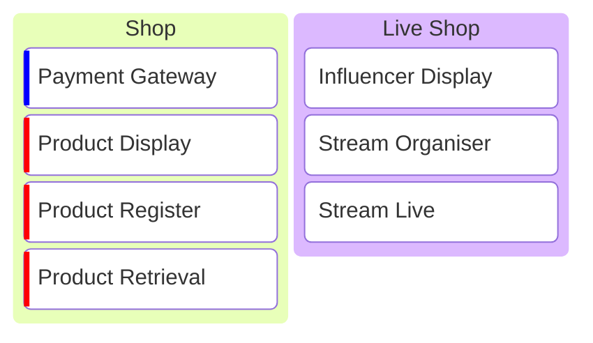

The Live Shop component needs the Payment Gateway. But that requires it to depend on 3 other things that it does not need, namely Product Display, Product Register and Product Retrieval.

This violates CRP.

The solution is to move the Payment Gateway out to its own Payment component that can be reused by both the Shop and Live Shop components.

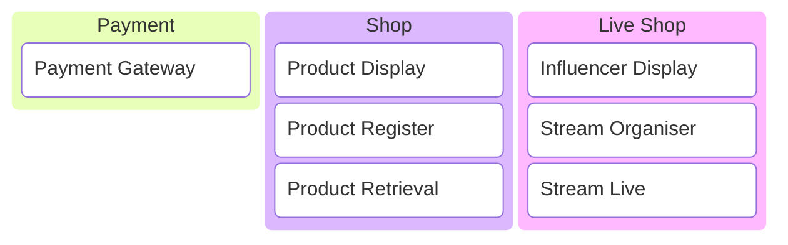

### The Triangle of Tension

In reality, CCP has a tendency to tell us how to group things into a Component, while CRP often tells us to break up that component into smaller pieces.

This creates a tension between the Component Cohesion principles. It tells us that to create highly cohesive Components, we need to be smart when applying CRP and CCP.

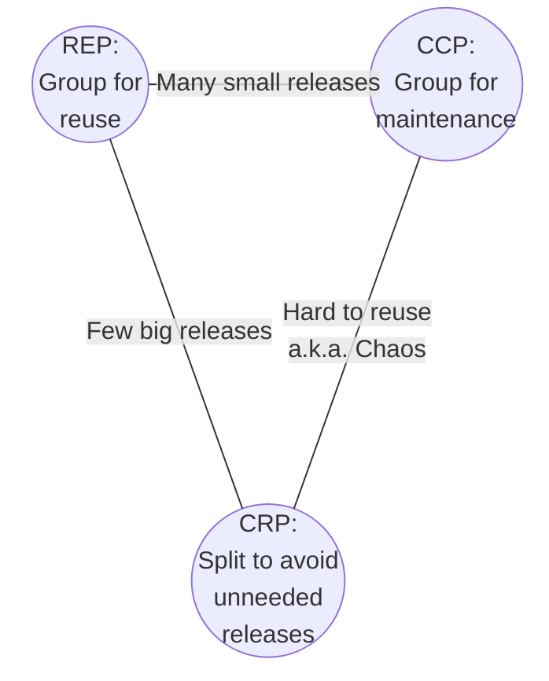

- Too far away from CCP, and a simple change might impact many components, which would result in huge releases. Our code becomes harder to maintain.
- Too far away from CRP, and our components will be too big and bulky, which could result in many small and unnecessary releases. Our code becomes harder to reuse.
- Too far away from REP, and we have chaos. Our code becomes nearly impossible to reuse.

So how do we position our components on this triangular map? 

Experience can give us an intuition. I will make an attempt to articulate this according to my believes. It of course depends on a combination of factors, such as:
- The size and maturity of our Organisation.
- The size and maturity of our Team.
- Who our User is, what their requirements and deadlines are.
- How big is our Budget.

But as a general guideline, new and small projects that need to move fast can focus on CCP. When the project is small, it is easier to keep things simple and promote maintenance. There are not many components and user of those components around that need reuse.

As the project, team size and team number gets bigger and more mature, we can afford to spend more effort in breaking down the big components to promote reuse, and move towards CRP.

## Component Coupling

If the Component Cohesion principles help us create highly cohesive Components, the Component Coupling principles make for loosely coupled Components.

### Acyclic Dependencies Principle (ADP)

> Allow no cycles in the component dependency graph

A cycle can be as small as:

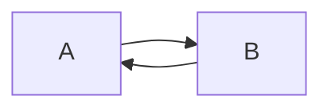

Or as big as:

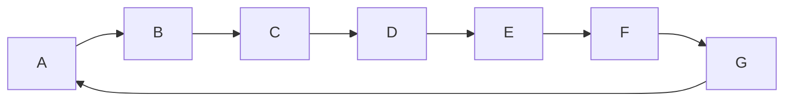

As long as you can trace a circle in the dependency graph, that violates ADP.

Violation has consequences, as a change in any of the Components in the cycle will affect the whole cycle. The bigger the cycle, the more devastating the effect. 

Instead of flexibly releasing changes in each Component separately, we are forced to releasing all the changes all at once with a weekly/monthly build. That adds a ton of risk.

Let's look at an example.

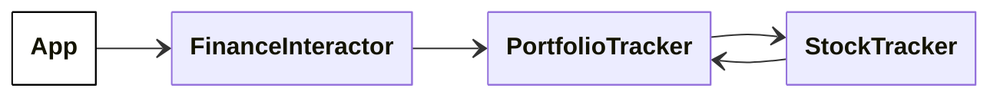

From PortfolioTracker, we can follow the dependency arrows and arrive back at itself. It is convenient for StockTracker to point back to the PortfolioTracker, to access its features. We see mistakes like this made very often, even from senior developers.

To resolve this situation, there are 2 approaches. We either use Dependency Inversion to reverse the arrow of dependency:

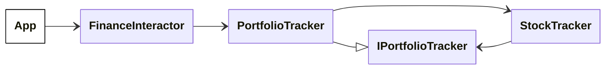

Or we separate the shared functions to a separate component

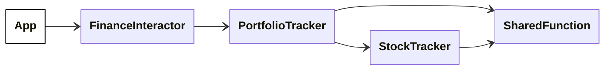

As requirements change and our application grows, we should monitor the architecture and break cycles which appear.

### Stable Dependencies Principle (SDP)

> Depend in the direction of stability

To be _stable_ means to be resistant to change. We're not talking about the _frequency of change_, but _how easy it is to change_. A coin standing on its side is not changing, but we can't say that it is stable.

This principle is the exact same as the [Direction of Stability](SOLID.md#the-direction-of-stability) concept which I introduced in my SOLID Principles page. 

It states that a Component should only depend on Components that are more stable than itself. So we should architect our Components in a way that the volatile Components are at the bottom, and the stable ones are at the top.

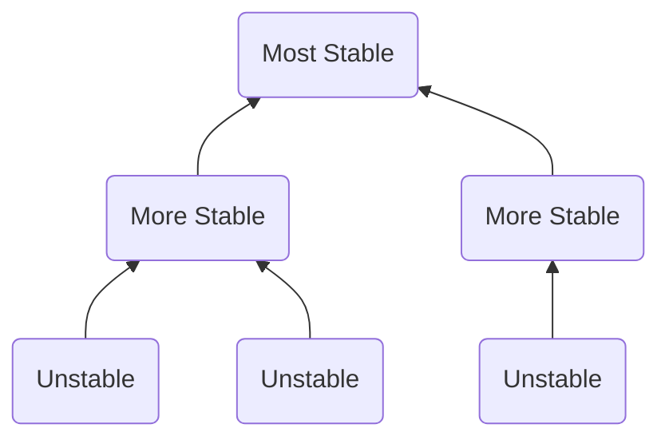

It is easy to see the detrimental effects of violating this principle. A change in a heavily depended upon Component will propagate its whole dependency tree, so such a mistake will be costly.

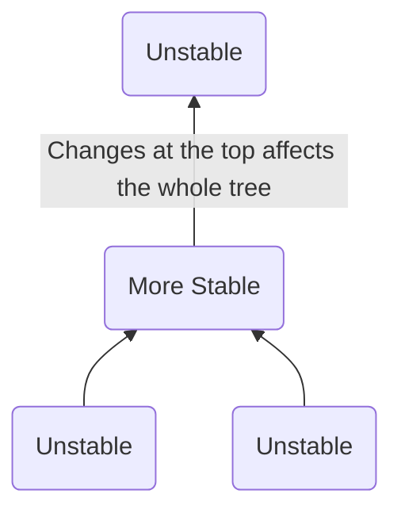

Employing DIP here can resolve the situation, but it is usually only a temporary solution.

```mermaid
---
  config:
    class:
      hideEmptyMembersBox: true
---
classDiagram
  direction BT
  
  class U1["Unstable"]
  class U2["Unstable"]

  class M1["More Stable"]

  class S["Unstable"]
  class SI["Interface"]

  U1 --> M1
  M1 --> SI
  U2 --> M1
  S --|> SI
```

This issue often indicates a deeper problem with the architecture that needs to be addressed by reformulating the Components and their dependencies, achieved by doing deeper investigations.


### Stable Abstraction Principle (SAP)

> A Component should be as abstract as it is stable

This principle may sound a bit abstract (pun intended), but it is actually quite simple. 

_The more stable a Component is, the more abstract it should be_. As in consisting of interfaces and abstract classes. This allows the Component to be extensible without sacrificing its stability.

On the other hand, more unstable Component can be more concrete, as it doesn't need as much overheads of the abstractions to stay flexible and easy to change.

This principle is concrete advice for aspiring developers who recently learned the SOLID principles and want to create interfaces for everything. We do it when it needs to have some stability.

In fact, we now have learned enough to draw the I/A graph, or the graph of Instability versus Abstraction.

```mermaid
quadrantChart
    title The I/A graph
    x-axis Low Instability --> High Instability
    y-axis Low Abstraction --> High Abstraction
    quadrant-1 Zone of Uselessness
    quadrant-2 OK
    quadrant-3 Zone of Pain - Rigid
    quadrant-4 OK
    Database schema: [0.2, 0.2]
    Utils library: [0.4, 0.1]
    Left over interfaces: [0.8, 0.7]
    Unused abstract classes: [0.7, 0.9]
```

The Zone of Pain contains rigid Components that are hard to extend. Database schemas and Utility libraries are examples. However these 2 examples are not equal.

Database schemas are normally very volatile, which is the reason for the need to carefully manage the interface between the application code and the datebase. Schema updates are generally painful.

Utility libraries on the other hand are normally nonvolatile, an example can be .NET string. When the Component is nonvolatile, it is generally not a problem in this zone. Making these more abstract can bring in unnecessary overheads.

The Zone of Uselessness contains interfaces and abstract classes that are not depended upon, hence they are useless. 

The other 2 zones contain Components that are not too abstract for its stability, nor too unstable for its abstraction. This is where we want our Components to be.

# Appendix

Uncle Bob's Clean Architecture presentation:

[](https://www.youtube.com/watch?v=o_TH-Y78tt4)